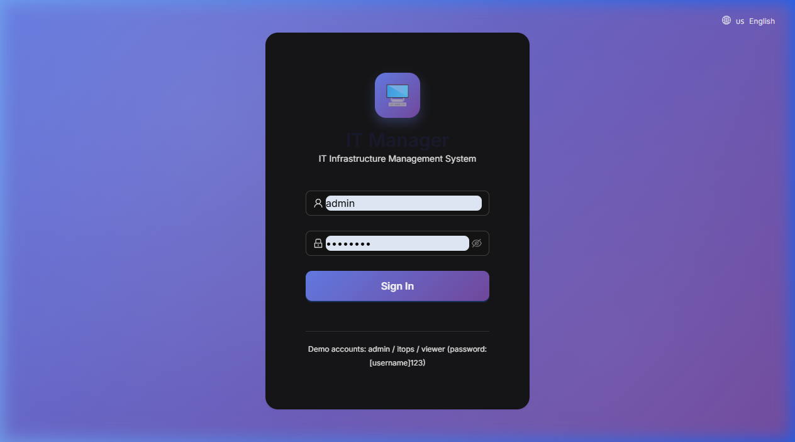
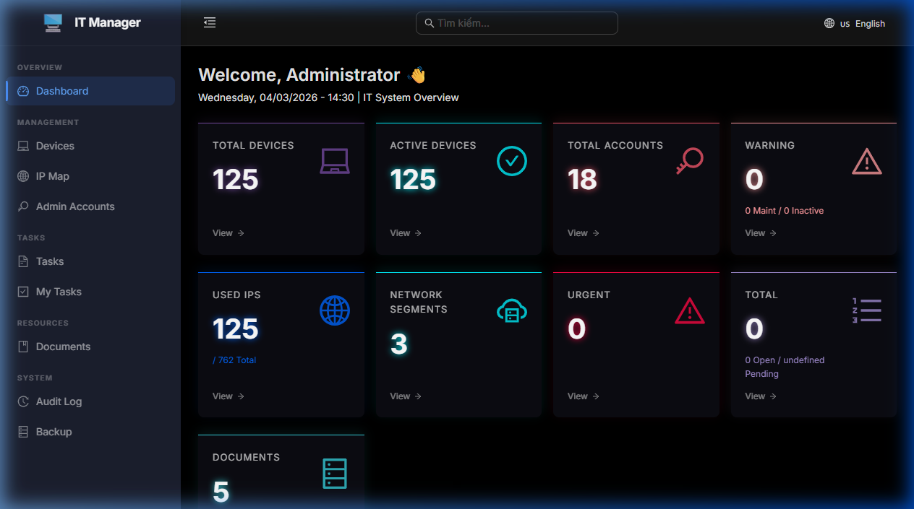
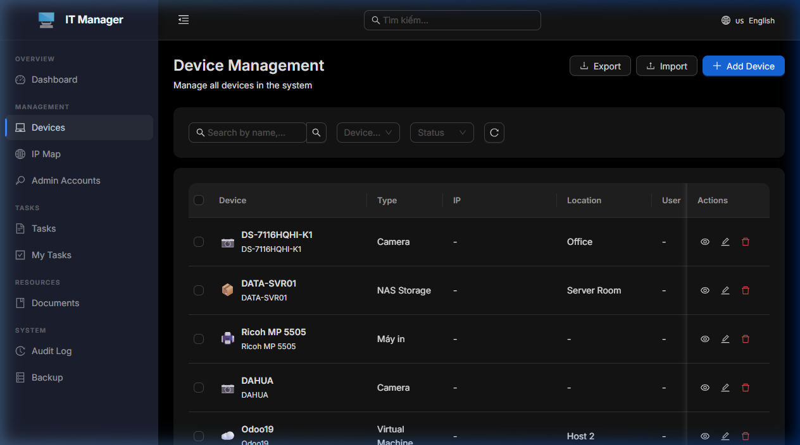

<div align="center">

# 🖥️ IT Manager

**A modern IT Infrastructure Management System for enterprises**

Manage devices, IP addresses, admin accounts, tasks, and more — all from a sleek dark-themed dashboard.

[](LICENSE)
[](https://nodejs.org)
[](https://docker.com)

</div>

---

## 📸 Screenshots

<div align="center">

### Login Page


### Dashboard


### Device Management


</div>

---

## ✨ Features

| Category | Features |
|----------|----------|
| **Device Management** | Track PCs, servers, cameras, printers, network equipment & more |
| **IP Map** | Manage network segments and IP address allocation |
| **Admin Accounts** | Securely store and manage service credentials |
| **Task Management** | Create, assign, and track IT tasks with priorities |
| **Documents & Wiki** | Internal knowledge base and file management |
| **Audit Log** | Full activity tracking with export capability |
| **Support Requests** | Built-in helpdesk for incoming IT requests |
| **Dashboard** | Real-time overview of your entire IT infrastructure |
| **Multi-language** | English & Vietnamese with easy locale switching |
| **Role-based Access** | Admin, IT Ops, and Viewer permission levels |
| **Telegram Notifications** | Real-time alerts for task updates |
| **Backup & Restore** | Database backup management |

---

## 🚀 Quick Start with Docker

### Prerequisites
- [Docker](https://docker.com) installed
- [Docker Compose](https://docs.docker.com/compose/) (included with Docker Desktop)

### Run
```bash
# Clone the repository
git clone https://github.com/vyntsoftreg-png/IT-Manager.git
cd IT-Manager

# Start with Docker Compose
docker-compose up -d

# Access: http://localhost:3001
```

### Default Credentials

| Username | Password | Role |
|----------|----------|------|
| admin | admin123 | Administrator |
| itops | itops123 | IT Operations |
| viewer | viewer123 | Viewer |

---

## 📦 Manual Setup (without Docker)

### Prerequisites
- Node.js 20+
- NPM 10+

### Installation
```bash
# Backend
cd backend
npm install
npm run dev    # Development
# or
npm start      # Production

# Frontend (new terminal)
cd frontend
npm install
npm run dev    # Development
npm run build  # Production build
```

### Production Deployment
```bash
# Build frontend
cd frontend && npm run build

# Run backend (also serves frontend)
cd backend && NODE_ENV=production node src/index.js
```

---

## 🔧 Configuration

### Environment Variables (`backend/.env`)
```env
PORT=3001
JWT_SECRET=your-secret-key
NODE_ENV=production
```

### Telegram Notifications (Optional)
```env
TELEGRAM_BOT_TOKEN=your-bot-token
TELEGRAM_CHAT_ID=your-chat-id
```

---

## 🏗️ Tech Stack

| Layer | Technology |
|-------|-----------|
| **Frontend** | React 18 + Vite |
| **Backend** | Node.js + Express |
| **Database** | SQLite (zero config) |
| **Auth** | JWT-based authentication |
| **Real-time** | Socket.io |
| **Deployment** | Docker + Nginx |

---

## 📁 Project Structure

```
IT-Manager/
├── backend/          # Express API server
│   ├── src/
│   │   ├── controllers/
│   │   ├── models/
│   │   ├── routes/
│   │   └── index.js
│   └── package.json
├── frontend/         # React + Vite SPA
│   ├── src/
│   │   ├── components/
│   │   ├── pages/
│   │   ├── services/
│   │   └── App.jsx
│   └── package.json
├── docs/             # Screenshots & documentation
├── docker-compose.yml
├── Dockerfile
└── nginx.conf
```

---

## 📝 License

This project is licensed under the MIT License.

## 📞 Contact

Developed by **IT Department**
